# CareerPilot

**AI-powered job application tracker & career CRM.** Track every application on a Kanban board, get GPT-4o resume feedback, generate tailored cover letters, search live job listings from 6 sources, build your resume in a LaTeX editor, and manage your entire job search in one place.

**Live demo:** [careerpilot-kappa.vercel.app](https://careerpilot-kappa.vercel.app)

---

## Screenshots

### Landing Page
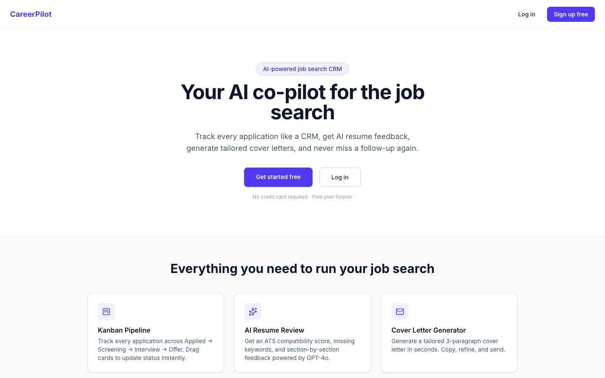

### Kanban Pipeline Dashboard
Drag-and-drop across Applied → Screening → Interview → Offer → Rejected. Stat cards update instantly from your local data — no waiting on analytics.

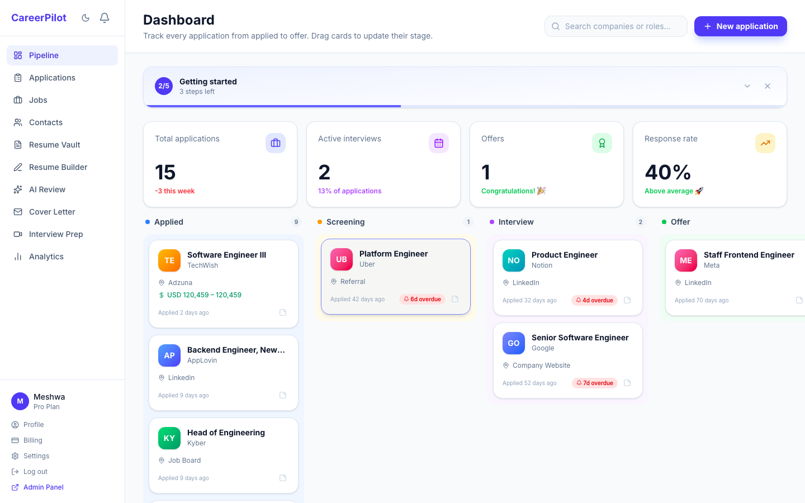

### Applications List
Sortable table with status filter tabs, debounced search, bulk archive/delete, and Export CSV.

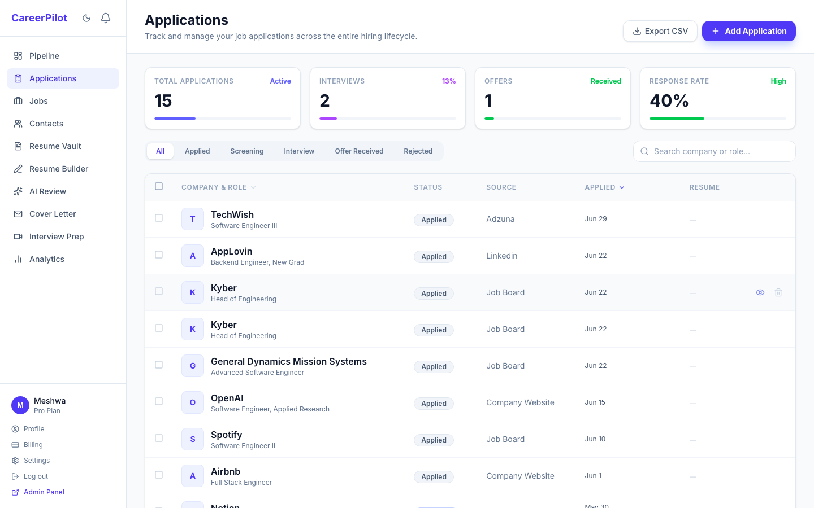

### Application Detail
Full application record with metadata, linked resume, saved cover letter, per-application contacts CRM, and interview rounds with outcome tracking.

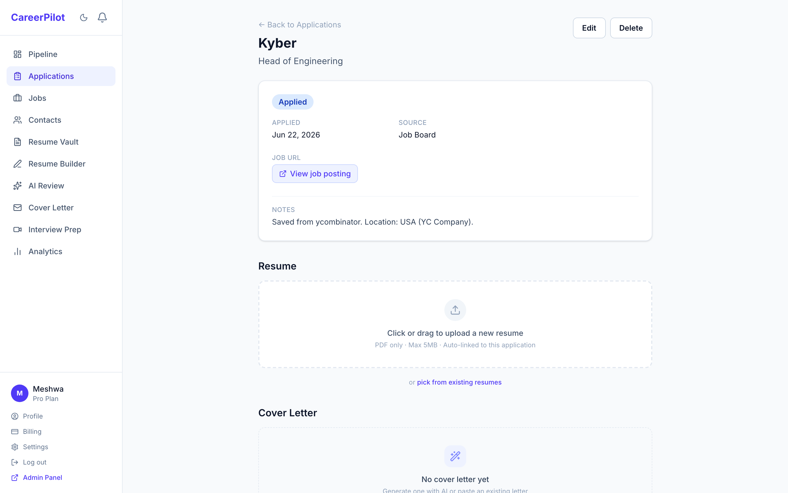

### Live Job Board
Fresh listings from **6 sources** (Adzuna, Remotive, YC HN, RemoteOK, Jobicy, The Muse). Save jobs, apply filters by country and source, and push any listing straight into your pipeline.

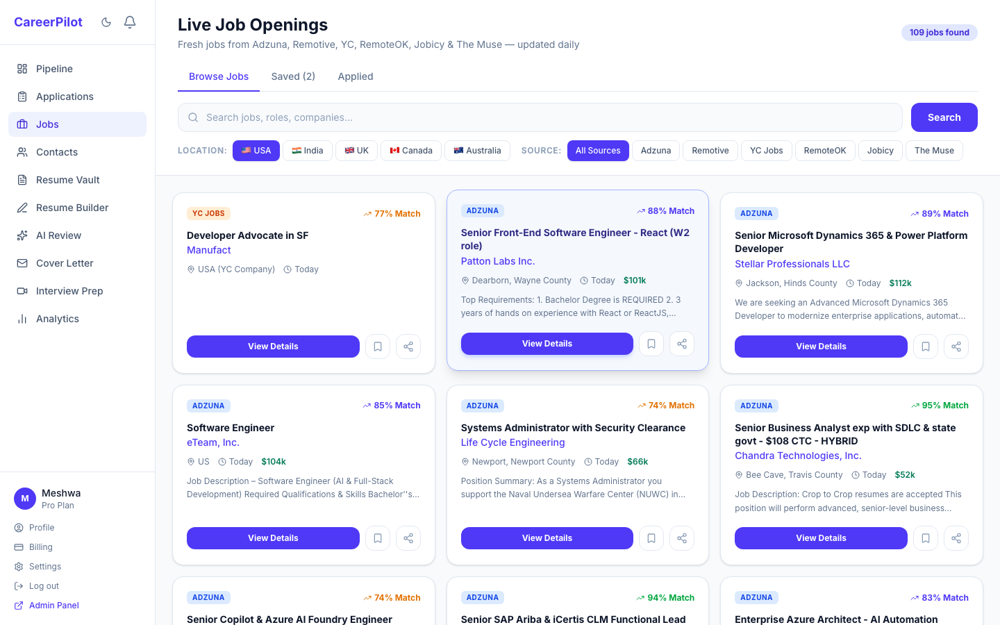

### Contacts CRM
Per-application contacts with name, role, email, LinkedIn, and notes. Global contacts page searches across all applications.

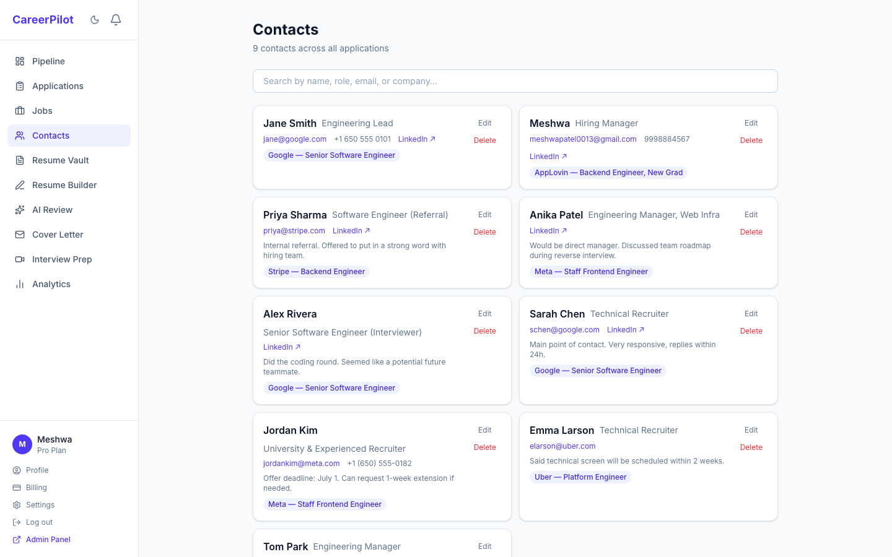

### Resume Vault
Upload multiple PDF resume versions with labels and version numbers. Presigned S3 download URLs, plan-based upload limits, and link any resume to an application.

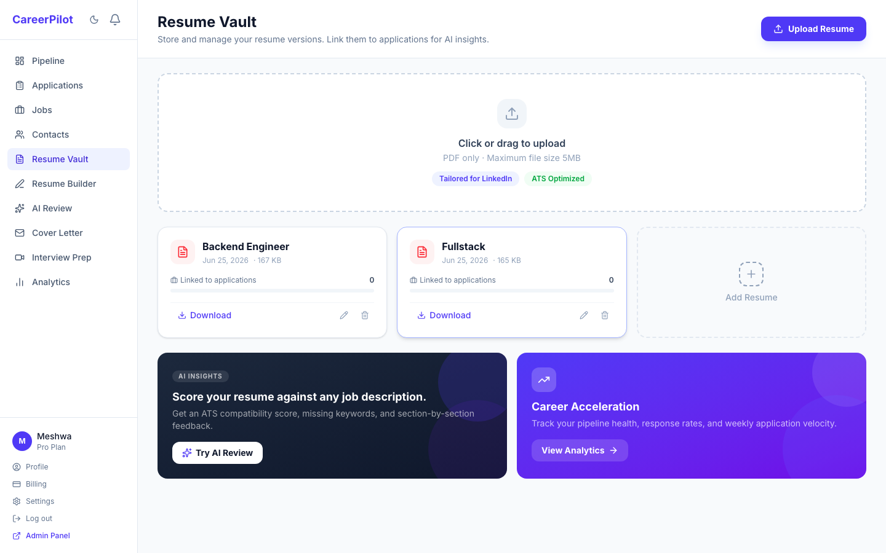

### Resume Builder
Overleaf-style split editor — write LaTeX on the left, see a live US-Letter preview on the right. Auto-saves to localStorage, detects multi-page overflow, and exports PDF via the browser print dialog.

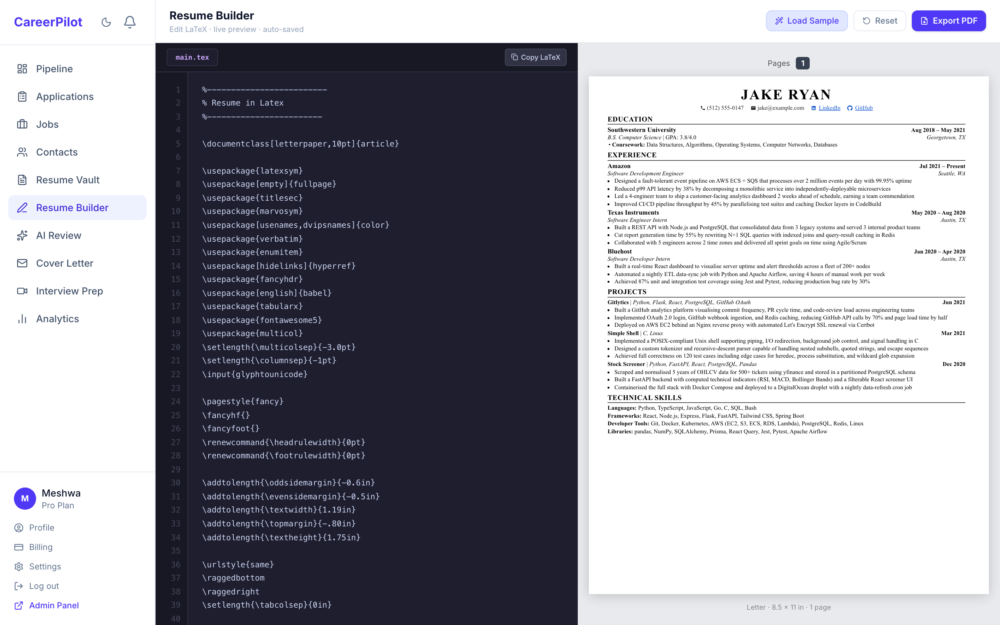

### AI Resume Review
Upload a resume PDF and paste a job description. GPT-4o returns an ATS compatibility score, missing keywords, and section-by-section feedback.

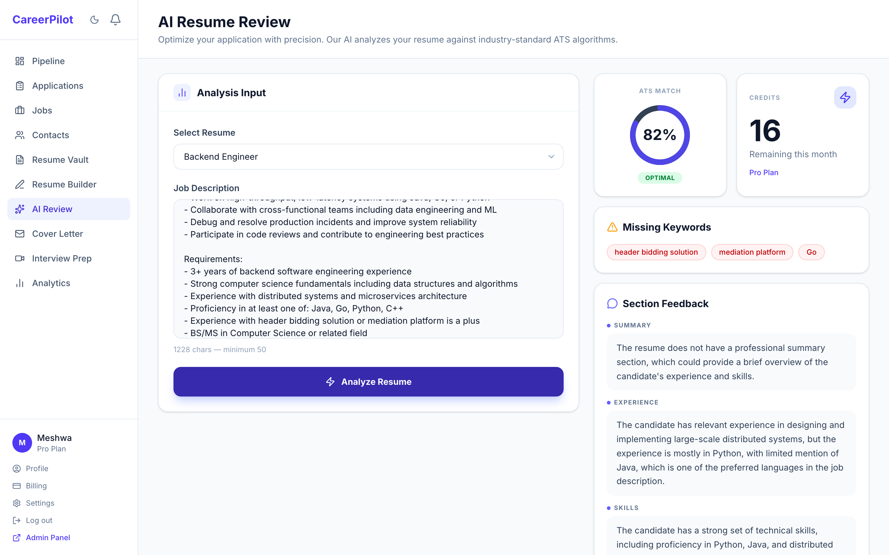

### AI Cover Letter Generator
Fill in company, role, and why you're interested. GPT-4o generates a tailored 3-paragraph letter you can copy or save directly to any application.

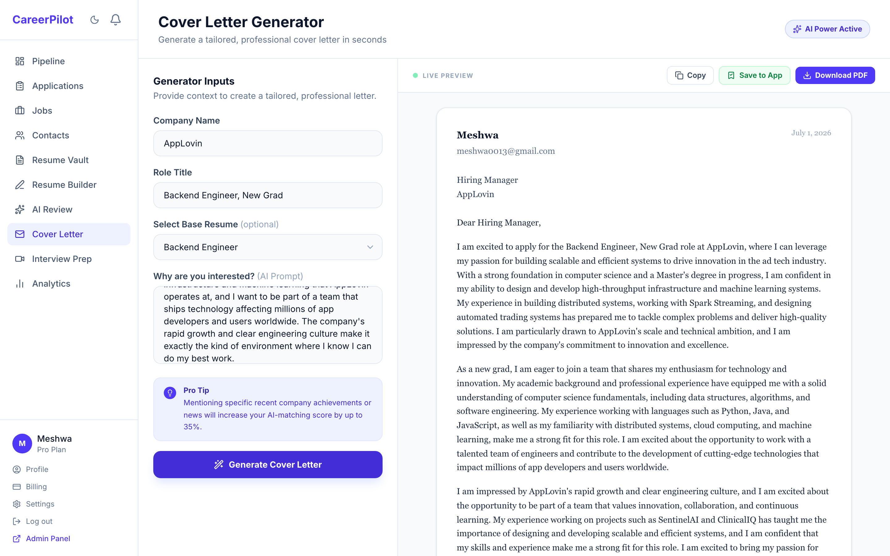

### Interview Prep
Enter a role, company, and job description. GPT-4o generates 10 tailored practice questions split across Behavioral and Technical categories, each with ideal answer guidance.

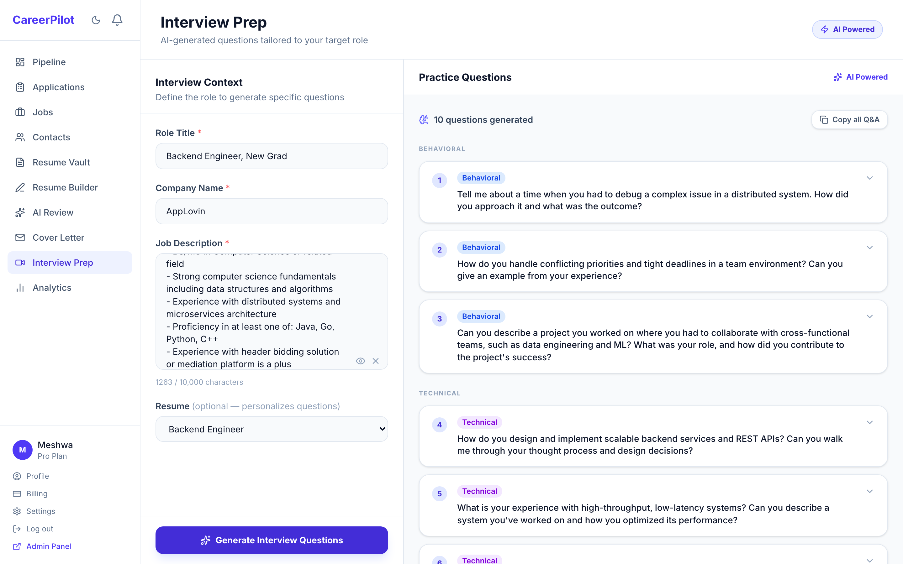

### Analytics
Pipeline funnel bar chart, applications-per-week line chart, top sources, and resume performance table — all powered by your real data.

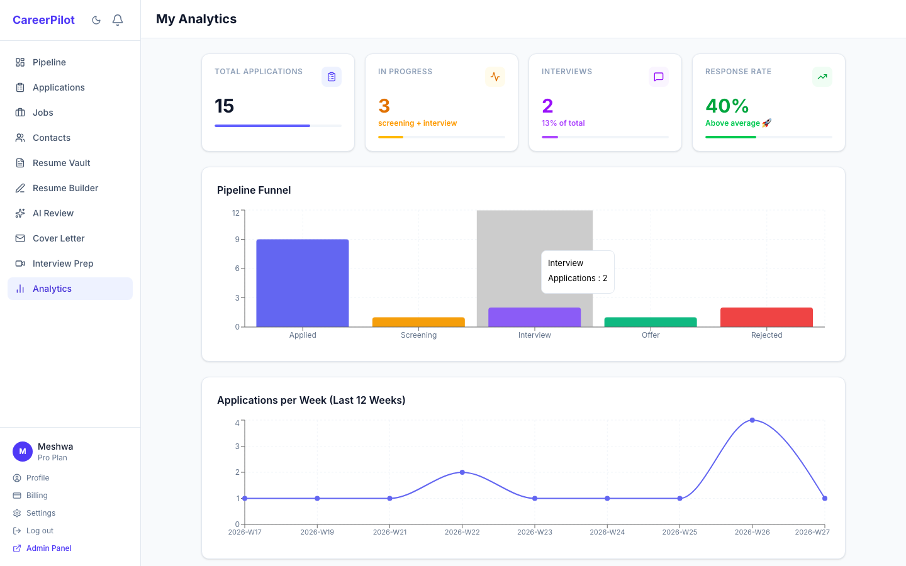

### Billing
Free / Pro ($9/mo) / Premium ($19/mo) plans via Stripe Checkout. Webhook-driven plan upgrades, customer portal for self-serve billing management.

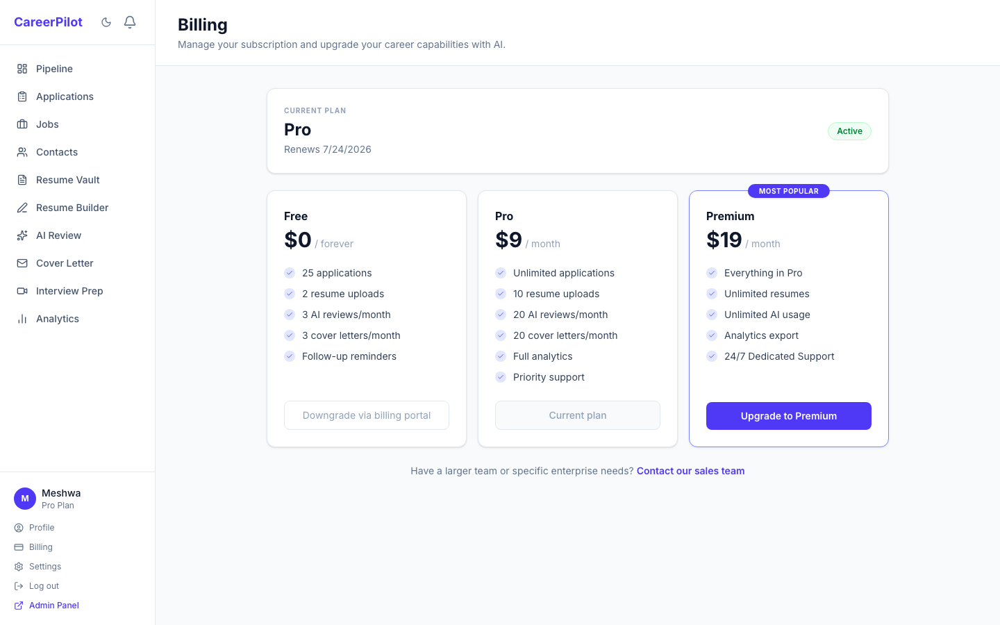

### Notifications
In-app notification centre with broadcast messages, follow-up reminders, and per-item mark-read. Unread count badge in the sidebar updates every minute.

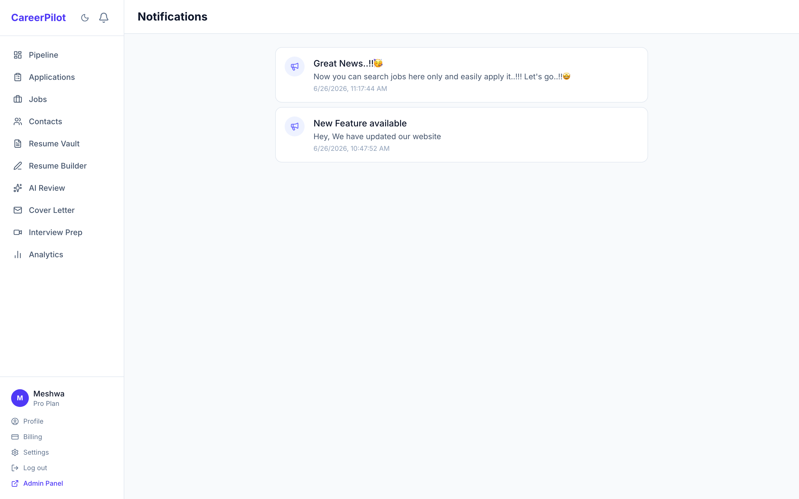

### Admin Panel
Platform-level analytics, user management with inline plan changes and ban/unban, AI cost tracking, broadcast notifications by plan segment, and Redis-backed feature flags.

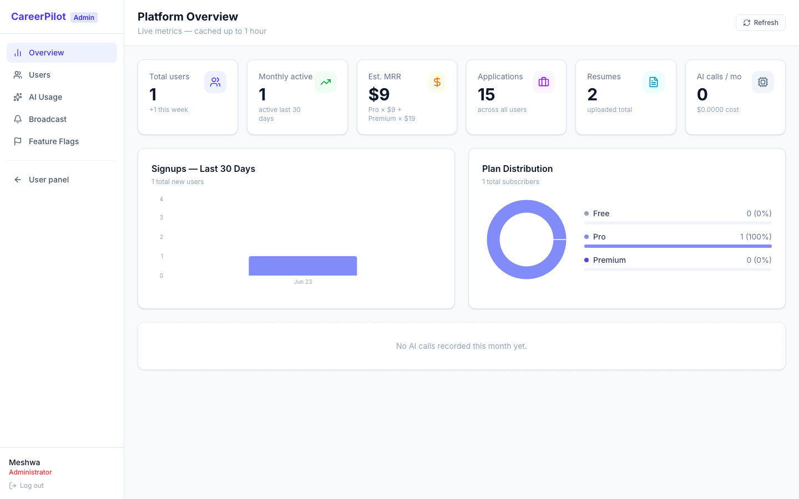

---

## Feature Overview

| Feature | Detail |
|---|---|
| **Kanban pipeline** | 5 stages, drag-and-drop, quick-notes popover, overdue badges |
| **Applications** | Full CRUD, status history, follow-up date, source tracking, bulk actions |
| **Interviews** | Per-application rounds with format, outcome, interviewer, and duration |
| **Contacts** | Per-application CRM contacts with email/LinkedIn links |
| **Jobs board** | 6 live sources, save/unsave, push to pipeline |
| **Resume vault** | Multi-version PDF upload, S3 presigned URLs, link to application |
| **Resume builder** | LaTeX editor + live preview + PDF export |
| **AI resume review** | GPT-4o ATS score, keyword gaps, section feedback (rate-limited by plan) |
| **AI cover letter** | GPT-4o 3-paragraph letter, save to application |
| **Interview prep** | GPT-4o generates 10 tailored questions (Behavioral + Technical) with ideal answer guidance |
| **Analytics** | Pipeline funnel, weekly trend, response rate, top sources |
| **Notifications** | In-app bell + SendGrid emails for follow-up reminders (daily cron) |
| **Auth** | Email/password + Google OAuth, JWT access + refresh token rotation, forgot/reset password |
| **Billing** | Stripe Checkout + Customer Portal + webhook handler |
| **Admin panel** | Users, AI usage, broadcast, feature flags, platform analytics |

---

## Tech Stack

| Layer | Tech |
|---|---|
| Frontend | React 19, Vite, Tailwind CSS v4, React Router v7, React Query v5, Axios, React Hook Form + Zod, Recharts, @hello-pangea/dnd |
| Backend | Node.js 20+, Express 5, Prisma 6 (PostgreSQL), JWT, Passport.js (Google OAuth), Multer, AWS SDK v3, node-cron, Zod, Winston |
| Data | PostgreSQL 15, Redis 7, AWS S3 (MinIO locally) |
| AI / Payments | OpenAI GPT-4o, Stripe, SendGrid |
| Deploy | Vercel (frontend), Render / Railway (backend), Neon / Supabase (DB), Upstash (Redis) |

---

## Local Development

### Prerequisites

- Node.js 20+
- PostgreSQL 14+
- Redis 7
- MinIO (local S3 substitute)

### 1. Clone & install

```bash
git clone <repo-url>
cd CareerPilot

cd server && npm install
cd ../client && npm install
```

### 2. Configure environment

```bash
cd server
cp .env.example .env
# Fill in DATABASE_URL, JWT secrets, and any API keys you have
```

### 3. Run the database migration

```bash
cd server
npx prisma migrate dev
```

### 4. Start MinIO (local S3)

```bash
MINIO_ROOT_USER=minioadmin MINIO_ROOT_PASSWORD=minioadmin \
  minio server /tmp/minio-data --address ":9000" --console-address ":9001" &

mc alias set local http://localhost:9000 minioadmin minioadmin
mc mb local/careerpilot-resumes
```

### 5. Start the servers

```bash
# Terminal 1 — API (http://localhost:5000)
cd server && npm run dev

# Terminal 2 — UI (http://localhost:5173)
cd client && npm run dev
```

Open **http://localhost:5173**.

---

## Environment Variables

### Backend (`server/.env`)

| Variable | Description |
|---|---|
| `DATABASE_URL` | PostgreSQL connection string |
| `REDIS_URL` | Redis connection string |
| `JWT_SECRET` | Access token signing secret (32+ chars) |
| `JWT_REFRESH_SECRET` | Refresh token signing secret (32+ chars) |
| `JWT_ACCESS_EXPIRY` | e.g. `15m` |
| `JWT_REFRESH_EXPIRY` | e.g. `7d` |
| `GOOGLE_CLIENT_ID` | Google OAuth client ID |
| `GOOGLE_CLIENT_SECRET` | Google OAuth client secret |
| `GOOGLE_CALLBACK_URL` | OAuth redirect URL |
| `AWS_ACCESS_KEY_ID` | S3 / MinIO access key |
| `AWS_SECRET_ACCESS_KEY` | S3 / MinIO secret |
| `AWS_REGION` | S3 region |
| `S3_BUCKET_NAME` | Bucket name |
| `S3_ENDPOINT` | MinIO endpoint — omit for real AWS S3 |
| `S3_FORCE_PATH_STYLE` | `true` for MinIO — omit for real AWS S3 |
| `OPENAI_API_KEY` | GPT-4o key |
| `STRIPE_SECRET_KEY` | Stripe secret key |
| `STRIPE_WEBHOOK_SECRET` | Stripe webhook signing secret |
| `STRIPE_PRO_PRICE_ID` | Stripe price ID for Pro plan |
| `STRIPE_PREMIUM_PRICE_ID` | Stripe price ID for Premium plan |
| `SENDGRID_API_KEY` | SendGrid API key |
| `SENDGRID_FROM_EMAIL` | Verified sender address |
| `CLIENT_URL` | Frontend URL (used for CORS) |
| `SESSION_SECRET` | Express session secret (for Google OAuth) |
| `ADZUNA_APP_ID` | Adzuna Jobs API app ID |
| `ADZUNA_API_KEY` | Adzuna Jobs API key |
| `MUSE_API_KEY` | The Muse API key |

### Frontend (`client/.env`)

| Variable | Description |
|---|---|
| `VITE_API_URL` | Backend base URL — leave empty for local dev (Vite proxy handles it) |
| `VITE_STRIPE_PUBLISHABLE_KEY` | Stripe publishable key |

---

## Deployment

### Frontend → Vercel

1. Push to GitHub
2. Import the repo in [vercel.com](https://vercel.com), set **Root Directory** to `client`
3. Add `VITE_API_URL=https://your-api.onrender.com`
4. `client/vercel.json` handles SPA routing automatically — no extra config needed

### Backend → Render / Railway

1. Create a service pointing at the `server/` directory — `server/Dockerfile` handles the build
2. Add a PostgreSQL database and a Redis instance
3. Set all env vars from the table above
4. On first deploy: `npx prisma migrate deploy` runs automatically via the start script
5. Add a Stripe webhook endpoint at `https://your-api.example.com/api/webhooks/stripe` and set `STRIPE_WEBHOOK_SECRET`

---

## API Reference

| Area | Endpoints |
|---|---|
| Auth | `POST /api/auth/register` · `/login` · `/logout` · `/refresh` · `/forgot-password` · `/reset-password` |
| Applications | `GET/POST /api/applications` · `GET/PATCH/DELETE /api/applications/:id` · `PATCH /:id/status` |
| Interviews | `GET/POST /api/applications/:id/interviews` · `PATCH/DELETE …/interviews/:iid` |
| Contacts | `GET/POST /api/applications/:id/contacts` · `PATCH/DELETE …/contacts/:cid` · `GET /api/contacts` |
| Resumes | `GET/POST /api/resumes` · `PATCH/DELETE /api/resumes/:id` |
| AI | `POST /api/ai/review-resume` · `POST /api/ai/cover-letter` · `POST /api/ai/interview-prep` |
| Jobs | `GET /api/jobs/search` · `GET/POST /api/jobs/saved` · `DELETE /api/jobs/:id` · `POST /api/jobs/:id/pipeline` |
| Notifications | `GET /api/notifications` · `GET /unread-count` · `PATCH /:id/read` · `PATCH /read-all` |
| Analytics | `GET /api/analytics/user` |
| Subscriptions | `GET /api/subscriptions/my` · `POST /create-checkout` · `POST /portal` |
| Webhooks | `POST /api/webhooks/stripe` |
| Admin | `GET /api/admin/analytics` · `/users` · `/users/:id` · `/ai-usage` · `GET/PATCH /api/admin/flags/:key` · `POST /api/admin/notifications/broadcast` |
| User Settings | `GET/PATCH /api/users/settings` |
